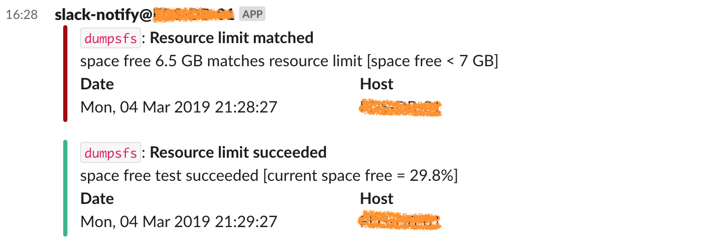
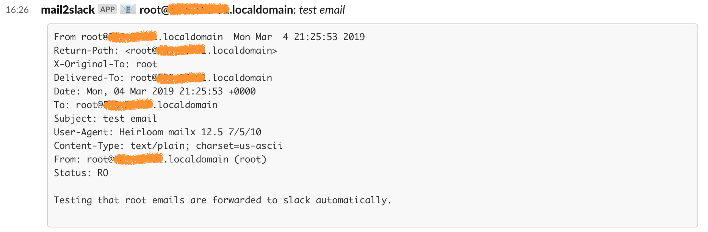

# Slack notify

This tool implements the communication with slack for various purposes. It
supports the following 3 modes:

- `msg`: sends a short message to slack. Useful for notifications from scripts.
- `monit`: sends a *monit* event to slack. See below the example of
  configuration and the message.
- `mail`: forwards local mail to slack. See below the the example of
  configuration and the message.

## Help screen

```
NAME:
   slack-notify - send information to slack via webhook

USAGE:
   slack-notify [global options] command [command options] [arguments...]

VERSION:
   2.0.0/2019-03-04T21:38:30+0000/7bfbb0

COMMANDS:
     msg      send a plain message to slack
     monit    monit mode, read information from env variables
     mail     relay user's email to slack
     help, h  Shows a list of commands or help for one command

GLOBAL OPTIONS:
   --webhook value           Slack webhook for sending messages [$SN_WEBHOOK]
   --channel value           Slack channel where to send message (default: "#random") [$SN_CHANNEL]
   --username value          Slack username (default: "slack-notify@<hostname>") [$SN_USERNAME]
   --config value, -f value  Read configuration from file. [$SN_CONFIG]
   --debug, -d               Enable debugging output
   --verbose, -i             Enable verbose output
   --help, -h                show help
   --version, -v             print the version
```

## Configuration file

Configuration file is optional, and is used to avoid specifying all necessary
parameters on the command line. By default, the tool for configuration file in
`/etc/slack-notify.conf`. The configuration file location can be overrided with
`-f` option. Supported formats for configuration file are `JSON` and `YAML`.

Example and supported options:

```
webhook: "https://hooks.slack.com/services/..."
channel: "#random"
username: "slack-notify@myserver"

monit_webhook: "https://hooks.slack.com/services/..."
monit_channel: "#monit"
monit_username: "monit@myserver"

mail_webhook: "https://hooks.slack.com/services/..."
mail_channel: "#srvmail"
mail_username: "mail2slack@myserver"
```

`monit_*` and `mail_*` options are used to override respective options for
`monit` and `mail` modes. 

> NOTE: Command line options and environment variables have a higher priority
> then values specified in configuration file.

## msg

Sends a simple test message to slack. Supports markdown formatting.

Example:

    $ slack-notify --webhook "https://hooks.slack.com/services/..." --channel "#random" -i msg "Example *message* with _markdown_"
    2019-03-04T21:47:21Z Message sent: Example *message* with _markdown_


>NOTE: If no message is provided, `slack-notify` will send a test message.

If configuration file is in place, then the command can be as simple as:

    $ slack-notify msg "Example *message* with _markdown_"
    $

The message is read from `stdin` if dash (`-`) is specified on command line:

    $ echo "Example *message* with _markdown_" | slack-notify msg -
    $


## monit

Sends a [monit](https://mmonit.com/monit/) event to slack.

Configure a check to execute `slack-notify` on alert:

```
check filesystem dumpsfs with path /dumps
        if space free < 7GB for 5 cycles then exec "/usr/local/bin/slack-notify monit"
          as uid "nobody" and gid "nobody"
          repeat every 30 cycles
        else if succeeded then exec "/usr/local/bin/slack-notify monit"
          as uid "nobody" and gid "nobody"
```

>NOTE: ensure the configuration file is in place to avoid specifying webhook and
>channel on the command line as in example above.

If `monit` triggers the alert, it will appear in slack as follows:



>NOTE: If no monit information is defined via environment variables,
>`slack-notify` will send a test event.

## mail

Reads email from local mbox files and sends to slack. Forwarded emails are
deleted from the mailbox. Uses `mail` from `mailx` package to read, and remove
mail messages.

`systemd` is used to monitor when the mail is added to the mailbox. Install and
activate unit files:

    # cp mail2slack\@* /etc/systemd/system/
    # systemctl daemon-reload
    # systemctl enable mail2slack@root.path --now

Now send a test email:

    $ mail -s 'test email' root <<< "Testing that root emails are forwarded to slack automatically."
    
When the email is added to a mailbox, `systemd` will run `slack-notify`:

    Mar  4 22:27:31 localhost systemd: Starting mail2slack activator...
    Mar  4 22:27:31 localhost slack-notify: 2019-03-04T22:27:31Z Message processed: root@XXXXX -> root@XXXXX | test email
    Mar  4 22:27:31 localhost systemd: Started mail2slack activator.

And it will be sent to slack:



